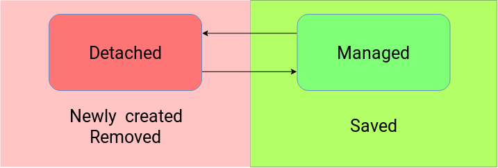

# JPA

## Quick intro/Crash course
> Part 1

---

# About me

* student
* not even an intern
* JVM enthusiast

---

## What is JPA?

The Java Persistence API is a specification for:
* accessing <!-- .element: class="fragment" data-fragment-index="0" -->
* persisting <!-- .element: class="fragment" data-fragment-index="1" -->
* and managing <!-- .element: class="fragment" data-fragment-index="3" -->

data between Java objects / classes and a relational database <!-- .element: class="fragment" data-fragment-index="4" -->

---

## Why JPA?

JPA is now considered the **standard** industry approach for Object to Relational Mapping (ORM) in the Java Industry.

---

## But wait...

JPA itself is just a specification, not a product.
It **cannot** perform persistence or anything else by itself.
JPA is just a set of interfaces and **requires** an implementation

---

## Provider

A provider is needed.
There are several:
* Hibernate <!-- .element: class="fragment" data-fragment-index="0" -->
* EclipseLink <!-- .element: class="fragment" data-fragment-index="1" -->
* OpenJPA <!-- .element: class="fragment" data-fragment-index="2" -->

Hibernate is used in more than 70% of projects <!-- .element: class="fragment" data-fragment-index="3" -->

Use Gradle or Maven, it's that simple <!-- .element: class="fragment" data-fragment-index="4" -->

---

## All we need is a single file


assuming you already have your database set up... <!-- .element: class="fragment" data-fragment-index="0" -->

---

## Persistence.xml

```xml
<?xml version="1.0" encoding="UTF-8" standalone="yes"?>
<persistence ... version="2.1">
  <persistence-unit name="h2" transaction-type="RESOURCE_LOCAL">
    <provider>org.hibernate.jpa.HibernatePersistenceProvider</provider>
      <properties>
        <property name="javax.persistence.jdbc.driver"
        value="org.h2.Driver"/>
        <property name="javax.persistence.jdbc.url"
        value="jdbc:h2:mem:testdb"/>
        <property name="hibernate.dialect"
        value="org.hibernate.dialect.H2Dialect"/>
        <property name="hibernate.hbm2ddl.auto" 
        value="update"/>
      </properties>
  </persistence-unit>
</persistence>
```

---

## POJO
```java
public class Author {

	private String firstName;
	private String lastName;

	// Constructors, getters and setters..
```
Note: Konwencja JavaBean

---

## Entity

```java
@Entity 
public class Author {

	@Id 
	@GeneratedValue(strategy = GenerationType.AUTO)
	private Long id;

	private String firstName;
	private String lastName;

	public Author() {
	}
	// Constructors, getters and setters..
```

```sql
Hibernate:
create table Author(
	id bigint generated by default as identity,
	firstName varchar(255),
	lastName varchar(255),
	primary key (id)
)
```
Note: W pełni funkcjonująca encja, wymagane są:
@Entity, @Id oraz konstruktor bezargumentowy

---

## Detached Entity and Managed Entity



---

## Annotations

```java
@Entity 
@Table(name = "Authors")
public class Author {
	
	//Id

	@Column(name = "last_name", 
		nullable = true, 
		unique = false, 
		insertable = true, 
		updatable = true, 
		length = 255)
	private String lastName;

	// Constructors, getters and setters..
```
Note: @Table -> nazwa tabeli nie encji

---

## Field vs getter
```java
@Column(name = "SAMPLE_STRING")  
private String sampleString;

public String getSampleString(){  
  return sampleString;  
}
```
<!-- .element: class="fragment" data-fragment-index="0" -->
vs
<!-- .element: class="fragment" data-fragment-index="1" -->
```java
private String sampleString;

@Column(name = "SAMPLE_STRING")  
public String getSampleString(){  
  return sampleString;  
}  
```
<!-- .element: class="fragment" data-fragment-index="1" -->
Note: używać tylko jednego bo się krzaczy
@Access

---

## Time types in entity - Default
```java
@Entity 
public class Event {

	// Id
	private Date date;
	// Constructors, getters and setters..
```
<!-- .element: class="fragment" data-fragment-index="0" -->

```sql
Hibernate: 
create table Events (
	id bigint not null,
	eventDate timestamp,
	event_name varchar(255),
	primary key (id)
)
```
<!-- .element: class="fragment" data-fragment-index="1" -->
> 2018-12-05 12:37:27.955000000

<!-- .element: class="fragment" data-fragment-index="2" -->

---

## Time types in entity - Time

```java
@Entity
public class Event {

	// Id
	@Temporal(TemporalType.TIME)
	private Date date;
	// Constructors, getters and setters..
```
<!-- .element: class="fragment" data-fragment-index="0" -->
```sql
Hibernate:
create table Events (
	id bigint not null, 
	eventDate time, 
	event_name varchar(255),
	primary key (id)
)
```
<!-- .element: class="fragment" data-fragment-index="1" -->
> 12:43:23


<!-- .element: class="fragment" data-fragment-index="2" -->
Note: Zmiany dokonują się na poziomie bazy danych
Zmiana w kodzie z DATE na TIME bez zmiany w bazie skutkowała pojawieniem się w bazie: 1970-01-01

---

## Time types in entity - Timestamp

```java
@Entity
public class Event {
	// Id
	@Temporal(TemporalType.TIMESTAMP)
	private Date date;
	// Constructors, getters and setters..
```
<!-- .element: class="fragment" data-fragment-index="0" -->
```sql
Hibernate:
create table Events (
	id bigint not null, 
	eventDate timestamp,
	event_name varchar(255),
	primary key (id)
)
```
<!-- .element: class="fragment" data-fragment-index="1" -->
> 2018-12-05 13:05:28.530000000

<!-- .element: class="fragment" data-fragment-index="2" -->

---

## Time types in entity - Date

```java
@Entity
public class Event {

	// Id
	@Temporal(TemporalType.DATE)
	private Date date;
	// Constructors, getters and setters..
```
<!-- .element: class="fragment" data-fragment-index="0" -->
```sql
Hibernate:
create table Events (
	id bigint not null, 
	eventDate date,
	event_name varchar(255),
	primary key (id)
)
```
<!-- .element: class="fragment" data-fragment-index="1" -->
> 2018-12-05

<!-- .element: class="fragment" data-fragment-index="2" -->

---

## Transient

```java
@Entity 
public class Author {

	// Id
	private String firstName;
	private String lastName;

	@Transient
	private int age;

	// Constructors, getters and setters..
```

```sql
Hibernate: 
insert into
Author (id, first_name, last_name)
values (null, ?, ?)
```

---

## Persistence classes

```java
EntityManagerFactory factory = 
	Persistence.createEntityManagerFactory("h2");
```
<!-- .element: class="fragment" data-fragment-index="0" -->
```java
EntityManager manager = factory.createEntityManager();
```
<!-- .element: class="fragment" data-fragment-index="1" -->
```java
EntityTransaction transaction = manager.getTransaction();
```
<!-- .element: class="fragment" data-fragment-index="2" -->

---

## Persist entity

```java
Author author = new Author("Tom", "Clancy");
transaction.begin();
manager.persist(author);
transaction.commit();
```

---

## Find entity

```java
Long authorId = 1L;
Author author = manager.find(Author.class, authorId);
System.out.println(author.getFirstName());
```
but something's wrong... <!-- .element: class="fragment" data-fragment-index="0" -->

author can be null! <!-- .element: class="fragment" data-fragment-index="1" -->

---

## Update entity using merge

```java
transaction.begin();
Author author = new Author("Tom", "Clancy");
manager.persist(author);
transaction.commit();

Author authorToBeFound = new Author();
authorToBeFound.setId(1L);
authorToBeFound.setFirstName("Arnold");
authorToBeFound.setLastName("Schwarzenegger");

transaction.begin();
Author found = manager.merge(authorToBeFound);
transaction.commit();
```

---

## Update entity using merge - generated SQL

```java
Hibernate: 
insert into Author (id, first_name, last_name)
	values (null, ?, ?)

Author{id=1, firstName='Tom', lastName='Clancy'}

Hibernate:
update Author 
	set 
		first_name=?,
		last_name=?
where id=?

Author{id=1, firstName='Arnold', lastName='Schwarzenegger'}
```

---

## Update entity using update

```java
Long authorId = 1L;
author = manager.find(Author.class, authorId);

transaction.begin();
author.setId(1L);
author.setFirstName("Arnold");
author.setLastName("Schwarzenegger");
transaction.commit();
```

---

## Update entity using update - generated SQL

### Exaclty the same!

---

## Remove entity 

```java
Optional.ofNullable(manager.find(Author.class, authorId))
	.ifPresent(found -> {
	transaction.begin();
	manager.remove(found);
	transaction.commit();
});

```

---

## Remove entity using merge

```java
Author toBeRemoved = new Author();
toBeRemoved.setId(1L);
transaction.begin();
manager.remove(manager.merge(toBeRemoved));
transaction.commit();
```

---

## Queries

* Query
* NativeQuery
* NamedQuery
* TypedQuery
* CriteriaQuery

---

## Simple select

```java
Query query = manager.createQuery("SELECT e FROM Event e");
List<Event> fromQuery = (List<Event>) query.getResultList();
fromQuery.forEach(System.out::println);
```

`Unchecked cast: 'java.util.List' to 'java.util.List<com.test.model.Event>'`
<!-- .element: class="fragment" data-fragment-index="0" -->
---

## Single result by id - ordinal parameter

```java
Query query = manager
.createQuery("SELECT e FROM Event e WHERE e.id=?1");

query.setParameter(1, 1L);

Event fromQuery = (Event) query.getSingleResult();
System.out.println(fromQuery);
```

---

## Single result by id - named parameter

```java
Query query = manager
.createQuery("SELECT e FROM Event e WHERE e.id=:id");

query.setParameter("id", 1L);

Event eventFromDatabase = (Event) query.getSingleResult();
System.out.println(eventFromDatabase);
```

---

## Casting is bad - TypedQuery<?>

```java
TypedQuery<Event> query = manager
.createQuery(
	"SELECT e FROM Event e WHERE e.id=:id",
	Event.class);

query.setParameter("id", 1L);
Event eventFromDatabase = query.getSingleResult();
System.out.println(eventFromDatabase);
```

---

## TypedQuery<?>

```java
TypedQuery<Event> query = manager
.createQuery("SELECT e FROM Event e", Event.class);

List<Event> eventsFromDatabase = query.getResultList();
eventsFromDatabase.forEach(System.out::println);
```

---

>That's all for today

---

Next presentation:
* Queries
* **Relationships**
* **Inheritance**
* Callback Annotations
* EventListeners